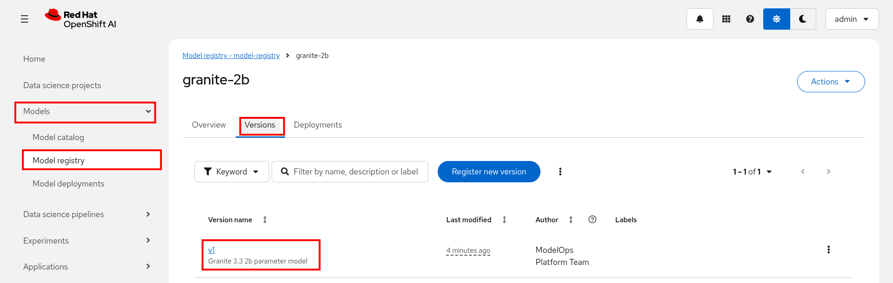

[[model-ops]]
= ModelOps tutorial (est. 1 hour)

*Goal*: As a member of the ModelOps team I want to be able to bring in models from external sites, get baseline performance and accuracy results on that model, and register the model along with the results in a central model registry. This will enable people in my organization to discover models that might be good candidates for their applications.  

NOTE: This section requires admin access because you'll be installing operators and creating new projects.

=== Configure OpenShift AI Model Registry
. Clone the project repository
+
[source,sh,role=execute]
----
git clone https://github.com/jhurlocker/modelops-benchmarking.git
----

. Make sure you're logged into your OpenShift cluster as *admin*. You can copy the login command from the OpenShift web console in the top right dropdown under your username. 
+
image::../images/ocp_token_menu.png["Click the copy login command", 25%, 25%]
+
image::../images/ocp_token_page.png["Copy the login with this token section"]

. It is recommended to upgrade your cluster to 2.25. To upgrade your cluster patch the operator subscription. 
+
Open a terminal window and login to your OpenShift cluster with the token you copied in the previous step.
+
[source,sh,role=execute]
----
oc patch subscription rhods-operator \
  -n redhat-ods-operator \
  --type='merge' \
  -p '{"spec":{"channel":"stable-2.25"}}'
----
+
The upgrade will take a few minute. Make sure you wait until the new version is installed before proceeding. In your OpenShift web console go to *Installed Operators* and select your *redhat-ods-operator* project. Go to the *Events* tab and make sure that the install strategy completed.
+
image::../images/rhoai_sub_225.png["RHOAI install strategy completed without error"]

. To enable your OpenShift AI model registry run the below command to patch your default data science cluster.
+
[source,sh,role=execute]
----
oc patch datasciencecluster default-dsc --type=merge -p '{"spec":{"components":{"modelregistry":{"managementState":"Managed"}}}}'
----

. The model registry needs a database to store version data. In the project you cloned change the directory to *modelops-benchmarking* and apply the deployment below so the model registry can store data.
+
[source,sh,role=execute]
----
oc apply -f model-registry/mysql-pvc.yaml
oc apply -f model-registry/mysql-secret.yaml
oc apply -f model-registry/mysql-service.yaml
oc apply -f model-registry/mysql-deployment.yaml
----

. Create a model registry through the OpenShift AI web console.

.. Login to your OpenShift AI web console. To find the route go to your OpenShift web console and click on *Network -> Routes*. Search for *rhods* and click on the location URL.
+
image::../images/rhoai_route.png["Open the OpenShift AI web console"]

.. In OpenShift AI go to *Settings -> Model registry settings*. Click on *Create model registry*.
+
image::../images/create_model_registry.png["Create a model registry"]

.. Add the following data in the form and click *Create*.
+
image::../images/model_registry_create1.png["Create model registry form part 1"]
+
image::../images/model_registry_create2.png["Create model registry form part 2"]
+
*Name*: 
+
[source,sh,role=execute]
----
model-registry
----
+
*Host*:
+
[source,sh,role=execute]
----
mysql.rhoai-model-registries.svc.cluster.local
----
+
*Port*:
+
[source,sh,role=execute]
----
3306
----
+
*Username*:
+
[source,sh,role=execute]
----
admin
----
+
*Password*:
+
[source,sh,role=execute]
----
mysql-admin
----
+
*Database*:
+
[source,sh,role=execute]
----
sampledb
----

.. In a few minutes your model registry status should be *Available*.
+
image::../images/model_registry_available.png["Model registry status available"]

=== Setup S3 storage
We'll be deploying Minio for S3 storage and we'll use a generic UI to manage S3 buckets. The UI should work with any S3 compatible storage.

NOTE: If you already have S3 storage you can skip this section.

. Install Minio and the S3 UI
+
[source,sh,role=execute]
----
oc new-project s3-storage
oc apply -f storage/minio-backend.yaml -n s3-storage
oc apply -f storage/s3ui-deployment.yaml -n s3-storage
----  

. Login to the S3 UI and create a bucket. We'll use S3 to store GuideLLM results, lm-eval results, custom benchmark files, and images for Quay. 

.. Get the S3 UI route
+
[source,sh,role=execute]
----
oc get route -n s3-storage | grep s3-ui
----  

.. Enter the bucket name as *benchmark-results* and click *Create Bucket*.
+
*Bucket name*
+
[source,sh,role=execute]
----
benchmark-results
----  
+
image::../images/s3ui_create_benchmark_bucket.png["Create benchmark results bucket"]
+
NOTE: The UI is configured to connect to the local Minio service running in the same namespace. If you are using another S3 storage provider click on the *Configure* button in the upper right corner to update the connection configuration. +
This UI is *not supported by Red Hat* or any other company and should be used for demo purposes only. 

=== Deploy Quay
We'll use Quay as our internal container registry where we'll push our modelcar image.
// +
// NOTE: The use of Quay is optional, but if you don't use a local cluster container registry you'll be deploying from external registries.

. Create a new project.
+
[source,sh,role=execute]
----
oc new-project quay-registry
----  
. Update the *quay/quay-config-secret-rados* hostname with the Minio API route.
.. Get the Minio API route.
+
[source,sh,role=execute]
----
oc get route -n s3-storage | grep minio-api
----  
.. Replace the _<REPLACE_ME_WITH_MINIO_API_ROUTE>_ with the Minio API route from the previous step. No need to add http/https or the port. For example, your hostname should look similar to: _minio-api-s3-storage.apps.cluster-11111.22222.com_
+
image::../images/quay_config_secret.png["Quay config secret"]

.. Deploy Quay
+
[source,sh,role=execute]
----
oc apply -f quay/operator-group.yaml -n quay-registry
oc apply -f quay/quay-config-secret-rados.yaml -n quay-registry
oc apply -f quay/subscription.yaml -n quay-registry
----  

.. Wait until the Quay operator is ready.
+
[source,sh,role=execute]
----
oc get pods -n quay-registry --watch
---- 
+
image::../images/quay_operator_status.png["Quay operator status"]

.. Create a new S3 bucket named *quay-registry-bucket*.
+
image::../images/s3_quay_bucket.png["S3 Quay bucket"]

.. Apply the Quay registry.
+
[source,sh,role=execute]
----
oc apply -f quay/quay-registry.yaml -n quay-registry
----

.. Open the Quay route in a web browser.
+
[source,sh,role=execute]
----
oc get route -n quay-registry | grep my-quay-registry-quay-quay
----

.. Click on *Create Account* 
+
image::../images/quay_create_acct.png["Create Quay account", 35%, 35%]

.. Enter in form fields and click *Create Account*
+
image::../images/quay_acct_create_form.png["Create Quay account form", 35%, 35%]
+
*Username*:
+
[source,sh,role=execute]
----
admin
----
+
*E-mail address*:
+
[source,sh,role=execute]
----
admin@admin.com
----
+
*Password*:
+
[source,sh,role=execute]
----
admin123
----

. We'll now pull the image from an external Quay registry and push the image into our local Quay registry running on our OpenShift cluster.

.. Pull the image
+
[source,sh,role=execute]
----
podman pull quay.io/redhat-ai-services/modelcar-catalog:granite-3.3-2b-instruct
----

.. Login to the local Quay registry.  
+
[source,sh,role=execute]
----
QUAY_URL=$(oc get route -n quay-registry | grep my-quay-registry-quay-quay | awk '{print $2}')
----
+
[source,sh,role=execute]
----
podman login $QUAY_URL -u admin -p admin123
----

.. Tag the image
+
[source,sh,role=execute]
----
podman tag quay.io/redhat-ai-services/modelcar-catalog:granite-3.3-2b-instruct $QUAY_URL/admin/granite-3.3-2b-instruct
----

.. Push the image. This may take two attempts. If there is a failure to push the image initially podman should retry.
+
[source,sh,role=execute]
----
podman push $QUAY_URL/admin/granite-3.3-2b-instruct
----

.. Go back to your local Quay repository web console. You should now see the granite-3.3-2b-instruct in the repository.
+
[source,sh,role=execute]
----
echo $QUAY_URL/repository/admin/granite-3.3-2b-instruct
----
+
image::../images/quay_granite_model.png["Granite model in Quay"]

.. Set the model to *Public* so the pipeline will be able to deploy the model from this repository. 
+
image::../images/quay_settings_make_public.png["Make model public"]

=== Enable TrustyAI
We'll need to enable TrustyAI in OpenShift AI so we can run lm-evaluation harness. 

. Patch the default data science cluster to enable TrustyAI.
+
[source,sh,role=execute]
----
oc patch datasciencecluster default-dsc -p '{"spec":{"components":{"trustyai":{"managementState":"Managed"}}}}' --type=merge
----

. Wait for a few minutes for TrustyAI to become available.
+
[source,sh,role=execute]
----
oc get pods -n redhat-ods-applications --watch | grep trustyai
----
+
image::../images/trustyai_pods_ready.png["TrustyAI pods ready"]

. Apply the below files to wrap up the TrustyAI configuration.
+
[source,sh,role=execute]
----
oc patch datasciencecluster default-dsc --type=merge -p '{"spec":{"components":{"trustyai":{"eval":{"lmeval":{"permitCodeExecution":"allow","permitOnline":"allow"}}}}}}'
----

=== Deploy the Pipeline
Now that we have all of the tools configured we can deploy our pipeline.

. Create a new project.
+
[source,sh,role=execute]
----
oc new-project vllm
----

. We need to give our pipeline service account access to be able to add new entries into the OpenShift AI model registry and also be able to get the routes in our s3-storage namespace so we can add them to the model registry.
+
[source,sh,role=execute]
----
oc adm policy add-role-to-user edit system:serviceaccount:vllm:pipeline -n rhoai-model-registries
oc adm policy add-role-to-user view system:serviceaccount:vllm:pipeline -n s3-storage
----

. Deploy the pipeline and pipeline tasks.
+
[source,sh,role=execute]
----
oc apply -f guidellm-pipeline/pipeline/deploy-model-task.yaml -n vllm
oc apply -f guidellm-pipeline/pipeline/guidellm-benchmark-task.yaml -n vllm
oc apply -f guidellm-pipeline/pipeline/upload-guidellm-results-task.yaml -n vllm
oc apply -f guidellm-pipeline/pipeline/lm-eval-task.yaml -n vllm
oc apply -f guidellm-pipeline/pipeline/model-registry-task.yaml -n vllm
oc apply -f guidellm-pipeline/pipeline/upload-lm-eval-results-task.yaml -n vllm
oc apply -f guidellm-pipeline/pipeline/benchmark-eval-pipeline.yaml -n vllm
oc apply -f guidellm-pipeline/pipeline/pvc.yaml -n vllm
oc apply -f results-ui/deployment.yaml -n vllm
----

. Update your *guidellm-pipeline/pipeline/benchmark-eval-pipelinerun.yaml* to use your local Quay endpoint that contains the granite-2b model.
+
[source,sh,role=execute]
----
oc get route -n quay-registry | grep my-quay-registry-quay-quay | awk '{print $2}'
----  
.. Replace the _<REPLACE_ME_WITH_QUAY_ROUTE>_ with the Quay route in your OpenShift cluster. No need to add http/https or the port. For example, your model-url and your uri in valuesContent should look similar to: _my-quay-registry-quay-quay-registry.apps.cluster-11111.22222.com_
+
image::../images/pipelinerun_quay_url.png["Update model URL to Quay route"]

. We need to add configmaps to our pipeline run so that lm-eval-harness can load the appropriate evaluation tasks. We'll go into more detail on the LMEvalJob in later sections.
+
[source,sh,role=execute]
----
oc create configmap mmlu-manifest --from-file=guidellm-pipeline/pipeline/mmlu.yaml -n vllm
oc create configmap custom-mmlu --from-file=guidellm-pipeline/custom-lm-eval/custom-mmlu.yaml -n vllm
----

. Time to run the pipeline!
Before we apply the PipelineRun lets take a look at the parameters we're setting in *guidellm-pipeline/pipeline/benchmark-eval-pipelinerun.yaml*.

.. Model parameters
+
*target*: The inference endpoint URL.
+
*model-name*: The model name we'll use in the deployment.
+
*processor*: The tokenizer we'll be using for GuideLLM and lm-eval.
+
image::../images/pipeline_params_model.png["Model specific parameters"]

.. GuideLLM parameters
+
*data-config*: Number of prompt and output tokens for the default guidellm dataset.
+
*max-seconds*: Sets the maximum duration (in seconds) for each benchmark run.
+
*rate-type*: The type of benchmark to run. See https://github.com/vllm-project/guidellm/tree/main?tab=readme-ov-file#configurations for more information.
+
*rate*: For rate-type sweep, the number of benchmarks.
+
*api-key*: If we are requiring an API key on our inference server. We'll disable this and leave the parameter blank for the simplicity of this tutorial. 
+
*max-concurrency*: Maximum number of concurrent requests 
+
*huggingface-token*: We'll leave this blank since we don't need a token to pull down the tokenizer.
+
image::../images/pipeline_params_guidellm.png["GuideLLM specific parameters"]

.. S3 parameters
+ 
*s3-api-endpoint*: S3 endpoint URL. We're using the service internal to the OpenShift cluster.
+
*s3-access-key-id*: S3 access key
+
*s3-secret-access-key*: S3 secret key
+
image::../images/pipeline_params_s3.png["S3 specific parameters"]

.. Benchmark parameters
+
*model-url*: The Quay URL where the model is located. Used in the model registry version for the model.
+
*lm-eval-job-name*: The name of the LMEvalJob we'll be running.
+
*lm-eval-custom*: Are we using a custom evaluation dataset for lm-eval? For the initial run by the ModelOps team we'll run the default dataset.
+
*custom-data*: Are we using custom benchmark data for GuideLLM? For the initial run by the ModelOps team we'll run the default dataset.
+
*custom-filename*: Name of the custom prompt file to use. For the initial run by the ModelOps team we'll run the default dataset.
+
*model-reg-author*: The author of who created the version in the model registry.  
+
image::../images/pipeline_params_custom.png["custom parameters"]

.. Helm parameters
+
*valuesContent*: The YAML we'll set to deploy the model to OpenShift AI. We'll deploy the model from our local Quay repository. 
+
image::../images/pipeline_params_helm.png["helm parameters"]

. Create a PipelineRun.
+
[source,sh,role=execute]
----
oc create -f guidellm-pipeline/pipeline/benchmark-eval-pipelinerun.yaml -n vllm
----

. *View Pipelinerun* - Go to the OpenShift web console and select *Pipelines*. Make sure you have selected the *vllm* project. You should see the pipeline you applied earlier. Click the *PipelineRuns* tab.
+
image::../images/ocp-web-console-pipelines.png["ocp pipelines page", 60%, 60%]
+
Click on the pipeline run that you just created and select the *Logs* tab.
+
Your model should be deploying from your local Quay registry. When the InferenceService is ready the model should be deployed.
+
image::../images/pipelinerun-deploy-model.png["deploy model task logs"]
+
You can also check to see the status of the model deployment in the OpenShift AI web console.

. *Benchmark task* - This is the GuideLLM task. Note that we're using the default data because we want to get a baseline of how the model performs on our infrastructure. 
+
When the benchmark completes you'll see the list of result files that are created.
+
image::../images/pipelinerun-benchmark.png["benchmark task logs"]

. *Upload GuideLLM task* - We upload the GuideLLM results to the *benchmark_results* bucket to S3 storage.  
+
Note the file names in the log that were successfully uploaded.
+
image::../images/pipelinerun-benchmark-upload.png["benchmark upload task logs"]
+
You can verify that the files were uploaded by viewing them in the S3 UI. Feel free to download them and look through the results. 
+
image::../images/s3_benchmark_results_guidellm.png["GuideLLM results in S3 bucket"]
+
The *benchmark_<TIMESTAMP>.txt* contains a summary of the run. 
+
image::../images/guidellm_benchmark_summary.png["GuideLLM summary results"]
+
We'll revisit these files again when we look at the version registered in the OpenShift AI model registry.  

. *lm-eval task* - If you scroll up in the logs you should see the lm-eval results at the top. The full results are printed out to the log in JSON format.
+
image::../images/pipelinerun_lmeval.png["lm-eval task"]

. *Upload lm-eval task* - We upload the lm-eval results to the *benchmark_results* bucket to S3 storage.  
+
Note the file names in the log that were successfully uploaded.
+
image::../images/pipelinerun_lmeval_upload.png["lm-eval upload task"]
+
If you go back to the S3 UI and look at the *benchmark_results* bucket you should see the *<TIMESTAMP>_lm-eval-results.json* file now.
+
image::../images/s3_benchmark_results_lmeval.png["lm-eval results in S3"]

. *Register model task* - This task adds the model to the OpenShift AI model registry and adds properties that link to the GuideLLM and lm-eval results so they are easily discoverable for AI Engineers in your organization. 
+
image::../images/pipelinerun-register-model.png["register model in OpenShift AI"]
+
Go to your OpenShift AI web console. Expand *Models* and select *Model Registry*. You should see *granite-2b* in your model registry now. Click on the link and then click on the *Versions* tab.
+
Since this is the first time you've run the pipeline you'll only see one version available. Click on that version.
+

+
Scroll down on the *Details* tab of this version until you see all of the version metadata. Notice the author is the one we set in our pipeline run parameters.
+
Also, notice all of the properties that have been set from the pipeline run. All of the blue dots are benchmark results with default datasets.
+
image::../images/model_registry_version_details.png["OpenShift AI model registry version details page"]
+
Click on the *GuideLLM Results UI* URL in the value column.
+
image::../images/guidellm_ui_resultspg1.png["GuideLLM results UI page 1"]
+
image::../images/guidellm_ui_resultspg2.png["GuideLLM results UI page 2"]
+
This UI summarizes the GuideLLM results that were generated in our GuideLLM pipeline task and uploaded to the *benchmark_results* S3 bucket.
+
Go back to the OpenShift AI model registry page and click on the *lm_eval Results UI* URL in the value column. 
+
image::../images/lmeval_ui_results.png["lm-eval results UI page"]
+
This UI summarizes the lm-eval results that were generated in our lm-eval pipeline task and uploaded to the *benchmark_results* S3 bucket.
+
These UI result pages for GuideLLM and lm-eval are not *supported by Red Hat* and are only used in this tutorial to give you an idea of how you can make these results easily consumable to other people in your organization, like an AI Engineer for instance. 
+
NOTE: There is a https://github.com/vllm-project/guidellm?tab=readme-ov-file#guidellm-ui[GuideLLM benchmark UI] that you should consider if you don't want to create or maintain your own solution. 

=== Recap
* You pushed a model into our organization's local Quay repository.
* Ran a pipeline to get performance and evaluation benchmarks on that model running on our organization's infrastructure. 
* Uploaded the results to S3 storage and registered a version of the model in the OpenShift AI model registry so other users can easily discover the model and associated benchmark results.

*Continue* -> <<ai_engineer_tutorial.adoc#ai-engineer, AI Engineer Tutorial>>